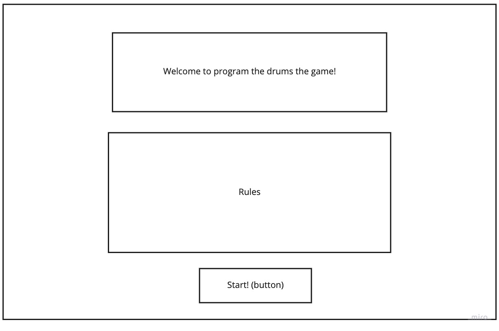
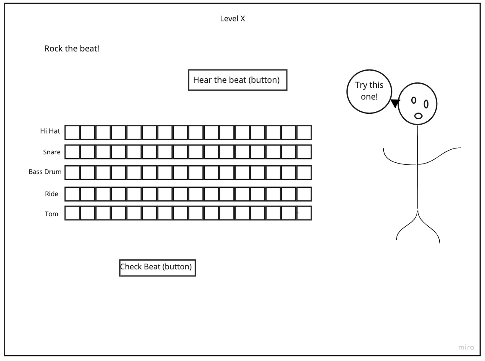
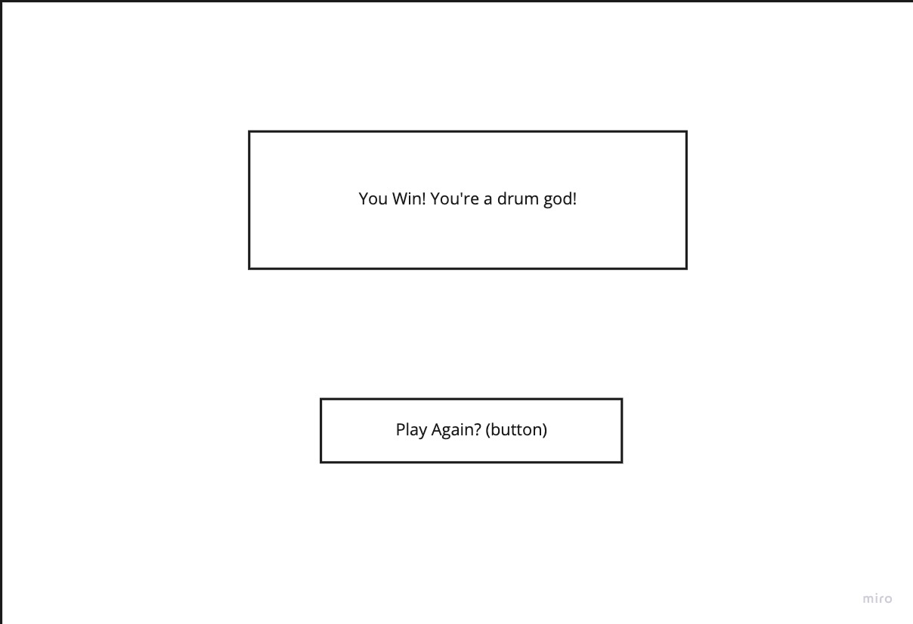

# PROGRAM THE DRUM PART THE GAME
## Objective
    The objective of this game is to teach the user how to program drums using a drum pattern grid and teach basic rythms. I chose this to create game as I'm a drummer who hates to program drums, but likes to teach people about music and how it is made. I've always wanted to code something that at least resembles a drum machine/programming grid and this is the perfect oppertunity to combine that with a game. 

## Game Rules 
    - There are 5 levels of 3 rounds
    - A drumloop will be played and you must recreate the part on drum programming grid
    - To win a round, you must recrete the drum loop correctly on the grid
    - To move on to the next level, you must recreate 2 of the 3 drum loops correctly 
    - If you make it through all 5 levels, you win
    - If you fail more than one drum loop on a level, you loose and are returned to the beginning

## Wireframes 

## User Stories
    - On load start page appears with title, rules, and button to start
    - When button to start is pushed level 1 appears
    - When you press "hear the beat" a drum part is played (audio)
    - When you press on a box on the grid it changes color and a sound of the corelating part of thedrumset occurs
    - Multiple boxes can and will be pressed at one time
    - Pressing on "check beat" will check to see if the correct boxes were checked
    - When level is complete, a new level will load
    - Once 5 levels are complete the end page will display 

## MVP
    - Have a start page
    - Load level paages 
    - Check if the grid matches the provided beat
    - When 5 levels are complete, display end page

## Stretch
    - Add a "hear your created beat" button that plays back what you inputed 
    - Create actually good styling 